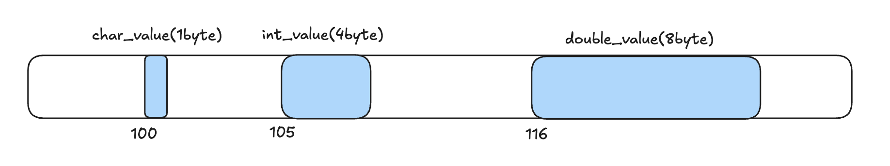

### 자료형

결국 비트를 어떻게 읽느냐를 지정하기 위함

종류

- char: 1byte
- short: 2byte
- int: 4byte
- long: 4 or 8byte
- long long: 8byte
- boolean
- etc...

C++ 표준이 보장하는 건 최소 크기와 대소 관계뿐

- sizeof(char) <= sizeof(short) <= sizeof(int) ...

따라서 int가 어떤 환경(16bit 시스템)에서는 2byte, 어떤 환경에선 4byte일 수도 있음

- 레거시 환경에서는 혹시나..?

그래서 고정 크기 정수형을 사용할 수도 있음 (<cstdint>)

- int8_t / uint8_t: 1byte
- int16_t / uint16_t: 2byte
- int32_t / uint32_t: 4byte
- int64_t / uint64_t: 8byte

네트워크 프로그래밍에서는 서로 다른 컴퓨터가 데이터를 주고 받는데, 시스템의 차이 때문에 다른 크기의 데이터로 인식을 하면 안되기 때문에 보장된 타입을 쓰는 것도 방법인듯.

- 직접 사내 코드를 확인하면서 볼 수 있을듯

실수는 `==`로 비교하는 게 아닌 "두 값의 차이가 아주 작은가"로 판단할 수도 있음

---

### 포인터와 메모리

이런 코드가 하나 있다고 해보자.

```
#include <iostream>

int main() {
    char char_value = 'P';
    int int_value = 27;
    double double_value = 4.31;

    return 0;
}
```

이 코드를 실행하면 아래와 같은 구조로 데이터가 저장된다.

- 메모리는 연속된 공간으로 구성되었으며 각 공간은 고유한 주소로 구별된다.
- 메모리 주소는 임의로 지정
- 참고로 메모리주소는 1byte의 간격을 가지고 있음



데이터가 어디있는지 알기 위해선 시작 메모리 주소를 알아야한다.

- 메모리 주소를 직접 다루는 것은 어렵고 복잡하므로
- C++를 비롯해 C에서도.. 프로그래밍 언어에서는 변수의 이름을 선언하고 해당 이름으로 데이터에 접근한다.

메모리 주소가 곧 실제 물리적 주소인 것은 아니다.

- 실제 런타임 중 동적으로 메모리를 할당하거나, 해제할 수도 있다.
- 그냥 가상의 주소라고 생각하는 게 좋을듯!

**포인터 예제**

```
#include <iostream>

int main() {
    char char_value = 'P';
    int int_value = 27;
    double double_value = 4.31;

    char *char_pointer_value = &char_value;
    int *int_pointer_value = &int_value;
    double *double_value = &double_value;

    return 0;
}
```

자료형 \*(포인터*변수*이름) 형태로 사용

일반 변수 앞에 붙은 `&`는 피연산자의 주소를 읽어오는 주소 연산자다.

포인터 변수도 일반 변수처럼 연속되는 메모리를 차지하고, 8byte 공간을 차지

- 64bit 시스템 기준

또한 데이터 형식과는 관계없이 포인터 변수의 크기는 같음. (어차피 주소를 기록하는 용도니)

- 그런데도 포인터 변수를 선언할 때 데이터 형식을 지정하는 이유는 해당 포인터가 가리키는 데이터의 형식을 명시하기 위해서임

**다시 접근**

```
#include <iostream>

int main() {
    char char_value = 'P';
    int int_value = 27;
    double double_value = 4.31;

    char *char_pointer_value = &char_value;
    int *int_pointer_value = &int_value;
    double *double_value = &double_value;

    std::cout << "char_value: " << char_value << "\n";
    std::cout << "*char_pointer_value: " << *char_pointer_value << "\n";

    return 0;
}
```

포인터의 depths를 1개로만 제한하지 않음

- double... multiple pointer를 이용할 수 있음

```
int *int_pt_value = &int_value;
int **int_pt_pt_value = &int_pt_value;
...
```

---

### 동적 메모리 할당

new, delete를 활용한 동적 메모리 할당 기능이 있음

`자료형 *변수_이름 = new 자료형;`

`delete 변수_이름;`

```
#include <iostream>

int main() {
    int *pt_int_value = new int;

    *pt_int_value = 100;
    std::cout << *pt_int_value << "\n";

    delete pt_int_value;

    return 0;
}
```

new/delete 직접 쓰는 걸 지양하고 스마트 포인터를 씀.
